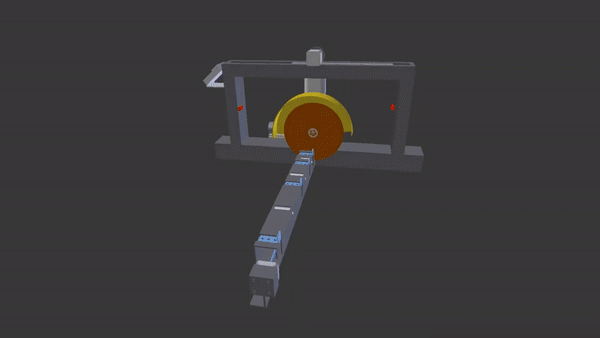

# AutoSaw     
This repository contains the information about ATMEGA 32A micro-controller based project - The Automated Abrasive Saw - 'AutoSaw'.
* It is a machine which cuts long metal box bars into smaller pieces automatically, after the user enter the input length and number of pieces required.
* This repository consists:
    1. 3dModel:- The 3d model of the machine. (.FCSTD file & .stl file)
    2. Animation:- The animation about the operation of the machine.
    3. AtmelProject:- micro-C codes to program the whole machine.
    4. PCB:- The Printed circuit board design, the wiring of Electronic/Electric components with PCB.

